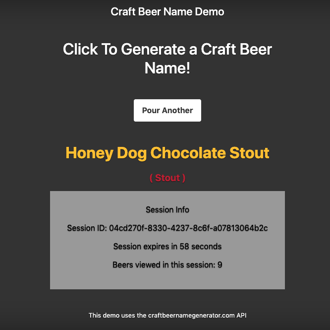

# redis-demo overview
Demo app that shows session & cache management for a Node.js app using express-sessions and connect-redis.

Session: The app queries an API for ML-generated craft beer names and displays them on the page. There is a session management panel that displays session ID, time until the session expires, and the number of beer names viewed in that session. 

Cache: The app fetch/query data and save it to redis for caching.

# how to run

Make sure you have have Redis server running locally (and mysqld):

```
redis-server
```
Then clone this repo, run npm install and then run it in dev mode:

```
git clone https://github.com/dantokoro/demo-redis.git
cd demo-redis
npm install
npm run dev
```

Then in your browser, go to http://localhost:3000. It should look something like this:



